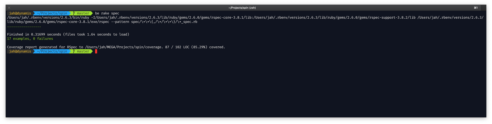
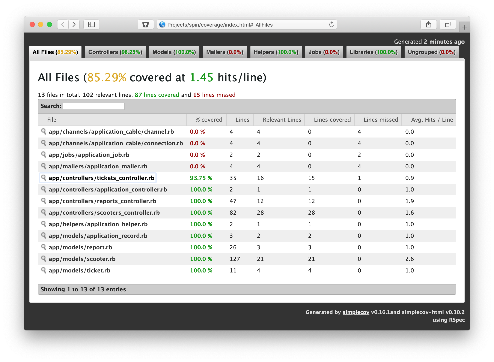

# Spin.app API

A code challenge for www.spin.app.

## Setup and testing interface

In a nutshell, after cloning this repo and having PostgreSQL setup properly
(see below)...

```
$ alias be=bundle exec
$ be rake db:create
$ be rake db:migrate
$ be rake spec
```

The specs pass:



And the coverage is pretty good, too:



## Let's talk PostgreSQL

This project uses PostgreSQL and will need the PostGIS extension. However, it's
not quite as simple as `enable_extension "postgis"`. Install it first, then
take note of the extensions that are being enabled by the first migration in
the app:

```ruby
enable_extension "postgis"
enable_extension "postgis_topology"
enable_extension "postgis_sfcgal"
enable_extension "fuzzystrmatch"
enable_extension "postgis_tiger_geocoder"
enable_extension "address_standardizer"
```

### Install PostGIS

If not already installed on your system, install PostGIS. On MacOS, assuming
you have PostgreSQL and Homebrew installed, you can just do:

```
$ brew install postgis
```

although even on a beastly machine this can take quite a while because it has
to compile a lot of dependencies.

### UUIDs

Since this could have potentially millions of records in a given table, I'm
using UUIDs here instead of integers. Yes they take up more memory for the
indexes, but I _have_ seen situations where databases using integers for pkeys
have hit the max integer limit. With the every-5-second check-in feature this
app needs, that limit could theoretically be hit. So let's not chance it: use
UUIDs. That's what they're for.